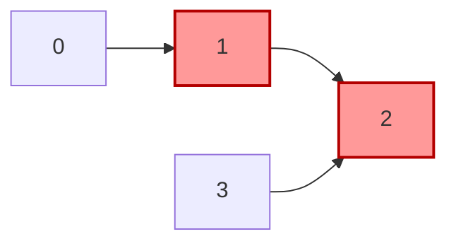
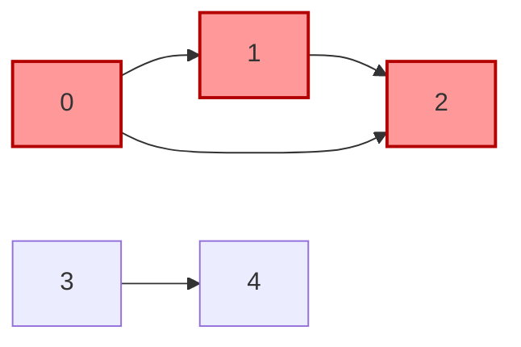
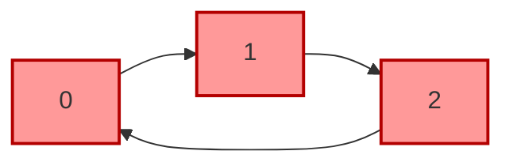

# [3310. Remove Methods From Project (Xóa Các Hàm Khỏi Dự Án)](https://leetcode.com/problems/remove-methods-from-project/)

**Độ khó:** `Medium`  
**Chủ đề:** `Depth-First Search`, `Breadth-First Search`, `Graph`, `Union Find`  
**Nguồn bài toán:** [LeetCode #3310](https://leetcode.com/problems/remove-methods-from-project/)

---

## Đề bài

Bạn đang bảo trì một dự án phần mềm có $n$ hàm được đánh số từ $0$ đến $n - 1$.

Bạn được cung cấp hai số nguyên $n$, $k$ và mảng hai chiều `invocations`, trong đó `invocations[i] = [ai, bi]` biểu thị rằng hàm $a_i$ gọi đến hàm $b_i$.

Hàm $k$ hiện đang có lỗi (bug). Vì vậy, hàm $k$ cùng với bất kỳ hàm nào được nó gọi (trực tiếp hoặc gián tiếp) đều bị xem là **đáng ngờ** (suspicious) và chúng ta cần xóa bỏ chúng.

Một nhóm các hàm chỉ có thể được xóa nếu **không có bất kỳ hàm nào bên ngoài nhóm gọi vào bất kỳ hàm nào bên trong nhóm đó**.

Hãy trả về một mảng chứa tất cả các hàm còn lại sau khi đã xóa toàn bộ các hàm đáng ngờ. Bạn có thể trả về các phần tử theo thứ tự bất kỳ. Nếu không thể xóa nhóm hàm đáng ngờ, **không xóa bất kỳ hàm nào** (nghĩa là giữ lại toàn bộ $n$ hàm).

---

## Ví dụ

### Ví dụ 1

**Đầu vào:**
```text
n = 4, k = 1, invocations = [[1, 2], [0, 1], [3, 2]]
```

**Đầu ra:**
```text
[0, 1, 2, 3]
```

**Minh họa:**



**Giải thích:**
- Các hàm $1$ và $2$ là đáng ngờ (hàm $1$ bị lỗi, hàm $1$ gọi hàm $2$).
- Tuy nhiên, chúng lại bị gọi bởi hàm $0$ và hàm $3$ (cả hai đều không thuộc nhóm đáng ngờ).
- Do đó, chúng ta không thể xóa chúng. Kết quả trả về tất cả các hàm: `[0, 1, 2, 3]`.

---

### Ví dụ 2

**Đầu vào:**
```text
n = 5, k = 0, invocations = [[1, 2], [0, 2], [0, 1], [3, 4]]
```

**Đầu ra:**
```text
[3, 4]
```

**Minh họa:**



**Giải thích:**
- Các hàm $0$, $1$, và $2$ là đáng ngờ.
- Không có hàm nào bên ngoài gọi vào nhóm $\{0, 1, 2\}$.
- Ta có thể xóa toàn bộ nhóm này, các hàm còn lại là: `[3, 4]`.

---

### Ví dụ 3

**Đầu vào:**
```text
n = 3, k = 2, invocations = [[1, 2], [0, 1], [2, 0]]
```

**Đầu ra:**
```text
[]
```

**Minh họa:**



**Giải thích:**
- Tất cả các hàm đều thuộc nhóm đáng ngờ (tạo thành một chu trình xuất phát từ hàm $k = 2$).
- Toàn bộ đều bị xóa, trả về mảng rỗng `[]`.

---

## Ràng buộc

- $1 \le n \le 10^5$
- $0 \le k \le n - 1$
- $0 \le \text{invocations.length} \le 2 \times 10^5$
- $\text{invocations}[i] = [a_i, b_i]$
- $0 \le a_i, b_i \le n - 1$
- $a_i \ne b_i$
- Tất cả các cặp trong `invocations` là phân biệt đôi một.